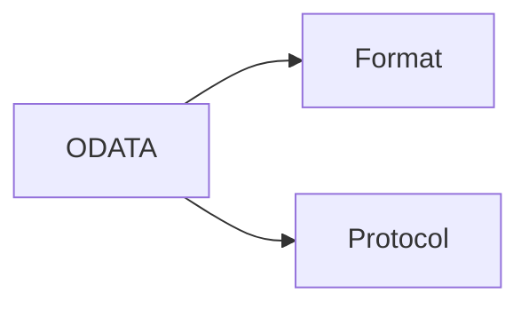

ODATA —> Open Data Protocol 

## Remote API vs Web API

Remote API: designed to interact with communication network. By remote, we mean that resources being manipulated by the API are somewhere outside computer making the request.

Web API: Communication Network(WWW)

ALL Web services are APIs, but not all APIs are web services.

## What does the RESTful API Client Request contain?

1. Unique recourse identifier:- URI ⇒ (URL- Location + URN-Name)
2. HTTP Method: GET, POST, DELETE, PUT, PATCH
3. HTTP Headers: Extra information

## What does the RESTful API server response contain?

- Status  line 
1XX :- Informational → Processing 102

2XX :- Success →Ok 200, Ok Created 201

3XX :- Redirection → moved to new URL 301

4XX :- Client Side Error → Bad request 400

5XX:- Server Side Error → Not implemented 501

- Message body
Contains recourse representation

-  Header

Port 443: HTTPS

HTTP method: GET

For HTTP PORT is 80

What is ODATA?

Applying and building on Web technologies such as

Provide access information from Variety of applications.

## 

Format:- How data is described and how it is serialized.

Protocol:- How that Data is manipulated.

Origin of ODATA format

Test Github-Notion synch

