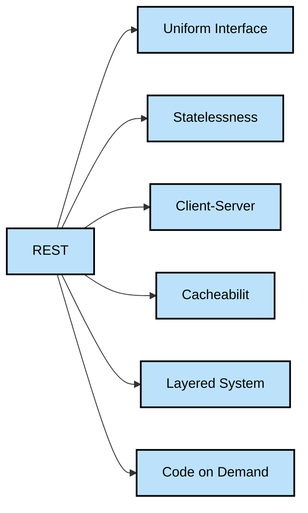
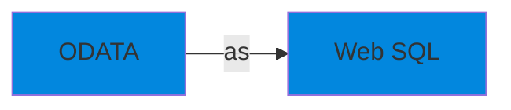
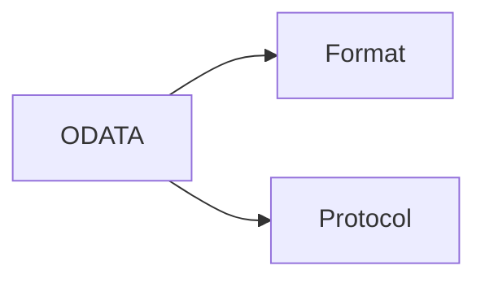

# ODATA

ODATA —> Open Data Protocol 
                (ISO International Organization for Standardization/
           IEC International Electrotechnical Commission approved)

OASIS (Organization for the Advancement of Structured Information Standards) standard that defines a set of best practices for building and consuming RESTful APIs
 
## What is API?
API (Application Programming Interface) is a set of rules, protocols, and tools that allows different software applications to communicate with each other.
## Four different ways API can work
1. SOAP APIs:- XML, Used in past
1. RPC APIs:- Remote Procedure Calls
1. WebSocket APIs:- Used JSON objects, two way communication
1. REST API: - Most Popular

# REST Principles/ 
architectural constraints

## Uniform Interface
It indicates Server transfers information in a standard format.
1. The formatted resource is called a Representation in REST.
1. Request should identify recourses by using URI
1. Clients have enough information in the resource representation to modify, delete the resource. The server meets this condition by sending metadata that describes the resource further. 
1. Client receive information about how to process the representation further. The server achieves this by sending self descriptive messages that contain metadata about how the client can best use them.
1. For other related resourses server sends hyperlink in the represenation. So client can dynamically discover more resources.

## Statelessness

1. Communication method in which the server completes every client request independently of all previous request.
## Layered System

The client can connect to other authorized intermediaries between client and server.
## Catchability
It stores some responses on the client or an intermediary to improve server response time.
## Code on Demand
Server can temporarily extend or customize client functionality by transferring softare programming code to client
Example:
When you fill registration form on any websites, your browser heighlights mistake. Such as incorrect phone number. It can do this by the code sent by server. 

## Remote API vs Web API

Remote API: designed to interact with communication network. By remote, we mean that resources being manipulated by the API are somewhere outside computer making the request.

Web API: Communication Network(WWW)

ALL Web services are APIs, but not all APIs are web services.

## What does the RESTful API Client Request contain?

1. Unique recourse identifier:- URI ⇒ (URL- Location + URN-Name)

1. HTTP Method: GET, POST, DELETE, PUT, PATCH

1. HTTP Headers: Extra information

## What does the RESTful API server response contain?

- Status  line 
1XX :- Informational → Processing 102
2XX :- Success →Ok 200, Ok Created 201
3XX :- Redirection → moved to new URL 301
4XX :- Client Side Error → Bad request 400
5XX:- Server Side Error → Not implemented 501

- Message body
Contains recourse representation

-  Header

Port 443: HTTPS

HTTP method: GET

For HTTP PORT is 80

What is ODATA?

ODATA is a Web protocol based om REST, for querying and updating Data.

Applying and building on Web technologies such as
1. HTTP
1. Atom publishing Protocol
1. RSS ( Really Simple Syndication) 

Provide access information from Variety of applications.

## 

Format:- How data is described and how it is serialized.

Protocol:- How that Data is manipulated.

Origin of ODATA format

_Synced automatically from Notion._
